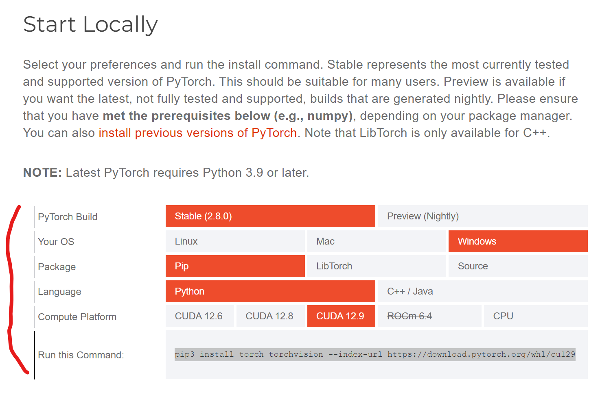

# Python-Yolo-ObjectDetection
Object Detection Using Opencv, Mediapipe and YOLO. We are connecting code to Unreal Engine and developing Interactive Contents and Game

## 1. Project Ouline
- We are Researching and Developing Object and Motion Detection.
- We Use Python and developed in Virtual Environment

## 2. Installation Lib
- Python Version : Python 3.10.11
- Check the requirements.txt
- pip install -r requirements.txt

## 3. Extra-Program and File
- labellmg -> https://github.com/HumanSignal/labelImg/releases/tag/v1.8.1
- cuDNN -> https://developer.nvidia.com/rdp/cudnn-archive
- pytorch -> https://pytorch.org/

## 4. Torch, Torchvision
1. pip uninstall torch torchvision -> Uninstall torch and torchvision
2. Go to cuDNN Website(above URL) Download cudnn .zip file

3. 

Copy and paste

4. Go to Pytorch Website(above URL) and click get started

5. 

Make sure match your cuda version and install